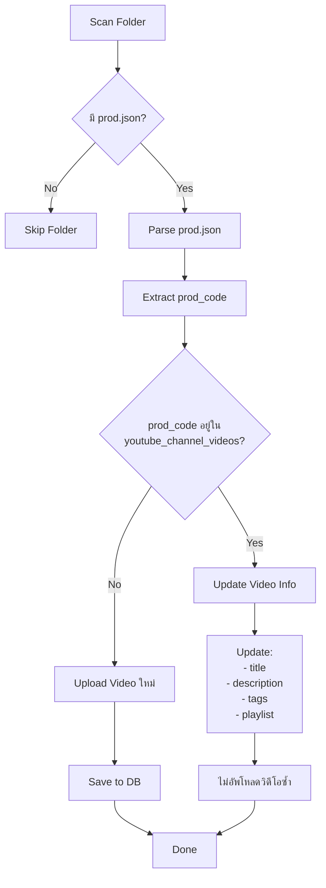

# MTYoutubeAutoPost - Blueprint & Implementation Plan

> โปรแกรม Bulk Upload วิดีโอไปยัง YouTube สำหรับนายหน้า Shopee พร้อมระบบ Affiliate Links

## 1. Project Overview

### 1.1 เป้าหมาย
- **อัพโหลดวิดีโอ** ทั้งแบบแนวนอน (16:9) และแนวตั้ง (9:16 Shorts)
- **แนบ Affiliate Links** ใน description เพื่อสร้างรายได้จากการเป็นนายหน้า
- **ตรวจจับ duplicate** โดยใช้ `prod_code` - หากพบซ้ำจะ **อัพเดทข้อมูล** แทนการอัพโหลดใหม่
- **Batch Processing** รองรับหลายๆ folder พร้อมกัน

---

## 2. โครงสร้าง `prod.json`

> [!IMPORTANT]
> - ไฟล์ `prod.json` ต้องอยู่ในทุก folder ที่มีวิดีโอ หากไม่มีจะถูกข้าม
> - **Videos ไม่ต้องระบุใน prod.json** - โปรแกรมจะสแกนหาไฟล์ MP4/MOV ใน folder อัตโนมัติ
> - Videos พร้อมอัพโหลดทันที ไม่ต้องปรุงแต่ง

```json
{
  "schema_version": "1.0",
  "prod_detail": {
    "prod_code": "SKU001",
    "prod_name": "ชื่อสินค้า",
    "prod_short_descr": "คำอธิบายสั้นๆ สำหรับ title",
    "prod_long_descr": "คำอธิบายยาวสำหรับ YouTube description\n\n🔥 คุณสมบัติเด่น:\n- คุณสมบัติ 1\n- คุณสมบัติ 2",
    "prod_tags": ["tag1", "tag2", "สินค้าขายดี", "shopee"],
    "category_id": 22,
    "privacy": "public"
  },
  "playlist": {
    "playlist_id": "PLxxxxxx",
    "playlist_name": "รองเท้ากีฬา",
    "create_if_not_exists": true
  },
  "aff_detail": {
    "platform": "shopee",
    "urls_list": [
      {
        "label": "🛒 สั่งซื้อที่ Shopee",
        "url": "https://s.shopee.co.th/xxxxx",
        "is_primary": true
      },
      {
        "label": "📦 ดูสินค้าอื่นๆ",
        "url": "https://s.shopee.co.th/store/xxxxx",
        "is_primary": false
      }
    ],
    "discount_code": "SAVE10"
  },
  "upload_config": {
    "made_for_kids": false,
    "notify_subscribers": true,
    "embeddable": true
  }
}
```

### 2.1 Field Descriptions

| Section | Field | Type | Required | Description |
|---------|-------|------|----------|-------------|
| **prod_detail** | `prod_code` | string | ✅ | รหัสสินค้า unique ใช้ตรวจ duplicate |
| | `prod_name` | string | ✅ | ชื่อสินค้า |
| | `prod_short_descr` | string | ✅ | คำอธิบายสั้นๆ (ใช้ใน title) |
| | `prod_long_descr` | string | ❌ | คำอธิบายยาว (ใน description) |
| | `prod_tags` | string[] | ❌ | Tags สำหรับ SEO |
| | `category_id` | int | ❌ | YouTube category (default: 22) |
| | `privacy` | string | ❌ | public/unlisted/private |
| **playlist** | `playlist_id` | string | ❌ | ใช้ playlist ที่มีอยู่ |
| | `playlist_name` | string | ❌ | ชื่อ playlist (สร้างใหม่ถ้าไม่มี) |
| | `create_if_not_exists` | bool | ❌ | สร้าง playlist ใหม่อัตโนมัติ |
| **aff_detail** | `urls_list` | array | ✅ | รายการ affiliate links |
| | `discount_code` | string | ❌ | โค้ดส่วนลด |
| **upload_config** | `made_for_kids` | bool | ❌ | สำหรับเด็ก? |

### 2.2 Video Auto-Detection

```
📁 Product_Folder/
├── prod.json          ← ข้อมูลสินค้า
├── video1.mp4         ← Auto-detect → ep.1
├── video2.mp4         ← Auto-detect → ep.2
├── another_video.mp4  ← Auto-detect → ep.3
└── thumbnail.jpg      ← (optional) thumbnail
```

**ลำดับ episode จะเรียงตามชื่อไฟล์ (alphabetically)**

### 2.3 Title Format

```
{{prod_code}}-{{prod_name}}-{{prod_short_descr}} ep.{{episode}}
```

**ตัวอย่าง (folder มี 3 videos):**
```
SKU001-รองเท้าวิ่ง Nike-สวมใส่สบาย ep.1
SKU001-รองเท้าวิ่ง Nike-สวมใส่สบาย ep.2
SKU001-รองเท้าวิ่ง Nike-สวมใส่สบาย ep.3
```

### 2.4 Description Template

```
{{prod_long_descr}}

━━━━━━━━━━━━━━━━━━━━━━
🛒 ลิงก์สั่งซื้อ
━━━━━━━━━━━━━━━━━━━━━━
{{affiliate_links}}

{{#if discount_code}}
🎁 ใช้โค้ด: {{discount_code}} รับส่วนลดทันที!
{{/if}}

━━━━━━━━━━━━━━━━━━━━━━
#{{tags}}
```


---

## 3. Database Schema (SQLite)

```sql
-- ========================================
-- PRODUCTS TABLE (from prod.json)
-- ========================================
CREATE TABLE products (
    id INTEGER PRIMARY KEY AUTOINCREMENT,
    prod_code TEXT UNIQUE NOT NULL,
    prod_name TEXT NOT NULL,
    prod_short_descr TEXT,
    prod_long_descr TEXT,
    prod_tags TEXT,  -- JSON array
    category_id INTEGER DEFAULT 22,
    playlist_id TEXT,
    
    -- Affiliate
    aff_urls TEXT,  -- JSON array
    discount_code TEXT,
    commission_rate REAL,
    
    -- Metadata
    source_folder TEXT,
    created_at TEXT NOT NULL,
    updated_at TEXT NOT NULL
);

CREATE INDEX idx_products_prod_code ON products(prod_code);

-- ========================================
-- VIDEOS TABLE
-- ========================================
CREATE TABLE videos (
    id INTEGER PRIMARY KEY AUTOINCREMENT,
    product_id INTEGER NOT NULL,
    
    -- File Info
    filename TEXT NOT NULL,
    file_path TEXT NOT NULL,
    file_size INTEGER,
    video_type TEXT CHECK(video_type IN ('video', 'short')),
    duration_seconds REAL,
    
    -- YouTube
    youtube_video_id TEXT,
    youtube_url TEXT,
    youtube_title TEXT,
    
    -- Status
    status TEXT CHECK(status IN ('pending', 'uploading', 'completed', 'failed', 'skipped')),
    error_message TEXT,
    
    -- Timestamps
    created_at TEXT NOT NULL,
    uploaded_at TEXT,
    
    FOREIGN KEY (product_id) REFERENCES products(id) ON DELETE CASCADE
);

CREATE INDEX idx_videos_product ON videos(product_id);
CREATE INDEX idx_videos_youtube_id ON videos(youtube_video_id);
CREATE INDEX idx_videos_status ON videos(status);

-- ========================================
-- UPLOAD_SESSIONS TABLE
-- ========================================
CREATE TABLE upload_sessions (
    id INTEGER PRIMARY KEY AUTOINCREMENT,
    session_id TEXT UNIQUE NOT NULL,
    
    -- Statistics
    total_videos INTEGER DEFAULT 0,
    uploaded_count INTEGER DEFAULT 0,
    updated_count INTEGER DEFAULT 0,
    failed_count INTEGER DEFAULT 0,
    skipped_count INTEGER DEFAULT 0,
    
    -- Status
    status TEXT CHECK(status IN ('pending', 'running', 'completed', 'paused', 'cancelled')),
    
    -- Timestamps
    started_at TEXT,
    completed_at TEXT
);

-- ========================================
-- YOUTUBE_CHANNEL_VIDEOS TABLE (Duplicate Check + URL Storage)
-- ========================================
CREATE TABLE youtube_channel_videos (
    id INTEGER PRIMARY KEY AUTOINCREMENT,
    
    -- YouTube Data
    youtube_video_id TEXT UNIQUE NOT NULL,
    youtube_url TEXT NOT NULL,
    
    -- Product Mapping
    prod_code TEXT NOT NULL,
    episode INTEGER DEFAULT 1,
    
    -- Metadata (synced from YouTube)
    title TEXT,
    description TEXT,
    tags TEXT,  -- JSON array
    privacy TEXT,
    playlist_id TEXT,
    
    -- Affiliate (from prod.json)
    aff_urls TEXT,  -- JSON array
    
    -- Status
    video_type TEXT CHECK(video_type IN ('video', 'short')),
    duration_seconds REAL,
    view_count INTEGER,
    
    -- Timestamps
    uploaded_at TEXT,
    last_synced_at TEXT NOT NULL,
    last_updated_at TEXT
);

CREATE INDEX idx_channel_prod_code ON youtube_channel_videos(prod_code);
CREATE INDEX idx_channel_prod_episode ON youtube_channel_videos(prod_code, episode);
CREATE INDEX idx_channel_youtube_url ON youtube_channel_videos(youtube_url);
```

---

## 4. Duplicate Detection & Update Logic



### 4.1 Update Fields (เมื่อพบ duplicate)

| Field | Update Action |
|-------|---------------|
| `title` | ✅ Update ด้วย format ใหม่ |
| `description` | ✅ Update ด้วย prod_long_descr + affiliate links |
| `tags` | ✅ Replace ด้วย prod_tags ใหม่ |
| `playlist` | ✅ เพิ่มเข้า playlist ใหม่ (ถ้ามี) |
| `affiliate links` | ✅ Update ใน description |
| `video file` | ❌ **ไม่อัพเดท** |

---

## 5. Project Structure

```
D:\dev\MTYoutubeAutoPost\
├── app/
│   ├── __init__.py
│   ├── main.py                 # Entry point
│   ├── config.py               # Configuration
│   │
│   ├── core/
│   │   ├── __init__.py
│   │   ├── orchestrator.py     # Main controller
│   │   ├── scanner.py          # Folder scanner
│   │   ├── uploader.py         # YouTube upload logic
│   │   ├── updater.py          # Update existing videos
│   │   └── duplicate_checker.py
│   │
│   ├── models/
│   │   ├── __init__.py
│   │   ├── database.py         # SQLite connection
│   │   ├── product.py          # Product model
│   │   ├── video.py            # Video model
│   │   └── schemas.py          # Pydantic schemas
│   │
│   ├── services/
│   │   ├── __init__.py
│   │   ├── youtube_api.py      # YouTube API wrapper
│   │   ├── template_engine.py  # Title/Description generator
│   │   └── thumbnail_service.py
│   │
│   ├── ui/
│   │   ├── __init__.py
│   │   ├── main_window.py      # PySide6 main window
│   │   ├── folder_selector.py
│   │   └── progress_view.py
│   │
│   └── utils/
│       ├── __init__.py
│       ├── logger.py
│       ├── video_info.py       # FFprobe wrapper
│       └── validators.py
│
├── data/
│   ├── db/
│   │   └── youtube_uploader.db
│   ├── credentials/
│   │   ├── client_secrets.json
│   │   └── token.json
│   └── logs/
│
├── tests/
│   ├── test_scanner.py
│   ├── test_duplicate_checker.py
│   └── test_template_engine.py
│
├── doc/
│   ├── t1.txt
│   └── blueprint.md
│
├── requirements.txt
└── README.md
```

---

## 6. Technology Stack

| Layer | Technology | Purpose |
|-------|------------|---------|
| **UI** | PySide6 | Desktop application |
| **Backend** | Python 3.12 | Business logic |
| **Database** | SQLite + SQLAlchemy | Data persistence |
| **YouTube API** | google-api-python-client | Upload & update videos |
| **Video Analysis** | ffprobe | Get video metadata |
| **Validation** | Pydantic | JSON schema validation |
| **Logging** | Loguru | Structured logging |

---

## 7. Key Features

### 7.1 Folder Scanning
- รองรับ drag & drop
- Recursive scan subdirectories
- Validate ว่ามี `prod.json` หรือไม่
- Auto-detect video type (16:9 vs 9:16)

### 7.2 Duplicate Detection

```python
def check_duplicate(prod_code: str) -> Optional[str]:
    """
    ตรวจสอบว่า prod_code มีอยู่ใน YouTube channel หรือไม่
    
    Returns:
        youtube_video_id if exists, None otherwise
    """
    # 1. Check local cache (youtube_channel_videos table)
    # 2. If not in cache, sync from YouTube API
    # 3. Return video_id if found
```

### 7.3 Update vs Upload Logic

```python
async def process_video(video: VideoTask):
    existing_video_id = check_duplicate(video.prod_code)
    
    if existing_video_id:
        # UPDATE MODE
        await youtube_api.update_video(
            video_id=existing_video_id,
            title=generate_title(video),
            description=generate_description(video),
            tags=video.prod_tags,
        )
        await add_to_playlist(existing_video_id, video.playlist_id)
    else:
        # UPLOAD MODE
        await youtube_api.upload_video(
            file_path=video.file_path,
            title=generate_title(video),
            description=generate_description(video),
            tags=video.prod_tags,
            ...
        )
```

---

## 8. User Review Required

> [!CAUTION]
> ก่อนเริ่ม implementation กรุณา review และตอบคำถามต่อไปนี้:

### คำถามสำหรับ User

1. **โครงสร้าง `prod.json`** - โครงสร้างที่เสนอมาเหมาะสมหรือไม่? ต้องการเพิ่ม/ลด fields อะไรบ้าง?

2. **Title Format** - `{{prod_code}}-{{prod_name}}-{{prod_short_descr}}` ใช้ได้หรือไม่? หรือต้องการรูปแบบอื่น?

3. **Multiple Videos per Product** - ใน 1 folder มีหลาย video ได้หรือไม่? ถ้าได้ ต้องการให้จัดการอย่างไร?

4. **Playlist Management** - ต้องการให้สร้าง playlist ใหม่อัตโนมัติได้หรือไม่? หรือต้องระบุ playlist_id เอง?

5. **UI Priority** - ต้องการ UI แบบ Desktop (PySide6) หรือ Command Line ก่อน?

6. **YouTube API Quota** - มี API key/credentials พร้อมใช้งานหรือยัง?

---

## 9. Verification Plan

### 9.1 Unit Tests

```bash
# Run all tests
pytest tests/ -v

# Run specific test
pytest tests/test_scanner.py -v
pytest tests/test_duplicate_checker.py -v
```

### 9.2 Integration Tests

1. **Test Folder Scanning**
   - สร้าง mock folder structure
   - ตรวจสอบว่า parse `prod.json` ได้ถูกต้อง

2. **Test Duplicate Detection**
   - Mock YouTube API response
   - ตรวจสอบ logic การตรวจจับ

3. **Test Title/Description Generation**
   - ตรวจสอบ format output

### 9.3 Manual Testing

1. สร้าง folder ตัวอย่างพร้อม `prod.json` และ video files
2. Run program และตรวจสอบ:
   - Folder ถูก scan ถูกต้อง
   - Title/Description generate ถูกต้อง
   - Video upload สำเร็จ (ใช้ unlisted สำหรับ test)
   - Duplicate detection ทำงานถูกต้อง

---

## 10. ข้อแนะนำเพิ่มเติม

### 10.1 Best Practices

1. **ใช้ Unlisted สำหรับ Test** - อย่า upload เป็น public จนกว่าจะ test เสร็จ

2. **Rate Limiting** - YouTube API มี quota limit (10,000 units/day)
   - Upload = 1600 units
   - Update = 50 units
   - ควรมี delay ระหว่าง requests

3. **Error Handling** - ควรมี retry mechanism สำหรับ network errors

4. **Backup Database** - ควร backup SQLite file เป็นประจำ

### 10.2 Future Enhancements

- [ ] Multi-channel support
- [ ] Scheduled uploads
- [ ] Analytics integration
- [ ] Thumbnail auto-generation
- [ ] Video watermark/intro/outro

---

## Summary

Blueprint นี้ครอบคลุม:

- ✅ โครงสร้าง `prod.json` สำหรับ product และ affiliate links
- ✅ SQLite database schema
- ✅ Duplicate detection และ update logic
- ✅ Project structure
- ✅ Technology stack
- ✅ Verification plan

**กรุณา review และตอบคำถามใน Section 8 เพื่อดำเนินการต่อ**
